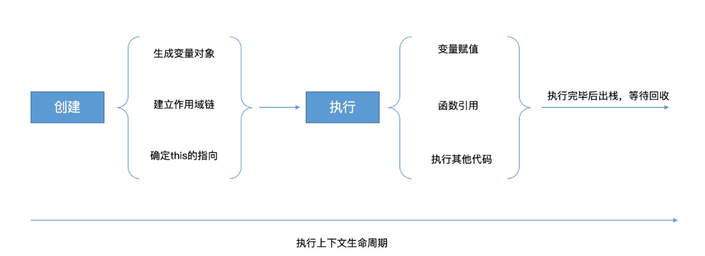

# 执行上下文

概念：执行上下文代码运行过程中动态产生的，分为全局执行上下文和函数执行上下文两种类型。
内容：执行上下文包含：上下文中的本地变量，作用域链 scope（编译时就确定），this 指向

# 执行上下文的生命周期包括两个阶段：创建阶段和执行阶段

## 在创建阶段：

1、创建变量对象（VO）：根据上下文的类型创建一个空的变量对象。
2、建立作用域链：作用域链是一个指向父级作用域的链表，用于查找变量的值。
3、确定 this 指向：在全局上下文中，this 指向全局对象（如 window）。在函数上下文中，this 的值取决于函数的调用方式。
4、初始化变量对象：将函数的参数、函数声明和变量添加到变量对象中。

## 在执行阶段：

1、执行代码：按照代码的顺序执行，对变量赋值等操作。
2、访问变量：通过作用域链查找变量的值。
3、执行函数：在函数上下文中，执行函数体内的代码。

# js 执行流程

JS 以执行栈的形式管理执行上下文。当代码开始运行时，全局上下文被推入执行栈，上下文中保存全局上下文中的变量。每执行一个新的函数，就会往执行栈中推入一个新的上下文，中断上一个上下文的执行。函数执行完毕后，该函数的上下文会从执行栈中被推出，然后继续执行被中断的上一个上下文。
